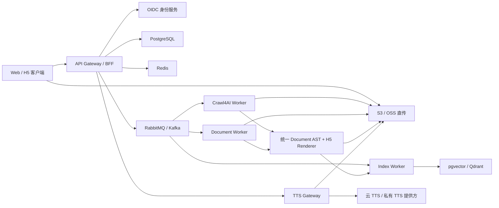

# 声阅：智能文档阅读与用户知识库实施方案

## 1. 结论与建设范围

建议采用“同步接入 + 异步处理 + 对象存储 + 用户级知识索引”的架构。前端上传或提交 URL 后立即拿到 `job_id`，通过 SSE 接收实时进度；后台按文件类型进入不同 Worker 池，最终生成结构化 Reader JSON、可导出 H5、原文件下载链接、可撤销的分享链接及用户私有知识索引。

本期建设分三个边界：

1. **前端体验层**：导入、处理进度、阅读器、TTS 播放器、导出、私有知识库和 API 契约展示。
2. **内容处理平面**：Crawl4AI、Office/PDF/Markdown 解析、安全清洗、统一文档 AST、H5 渲染。
3. **数据与知识平面**：用户/租户隔离、原文件与产物存储、文本分块、Embedding、向量检索、全文检索和删除级联。

## 2. 目标架构

### 推荐技术组合

| 分层 | 建议 | 说明 |
|---|---|---|
| Web | React / Next.js + TypeScript | Reader 和播放器作为独立组件，支持桌面和移动端 |
| API | FastAPI + Pydantic | Python 生态与 Crawl4AI/文档解析管线配合好，异步 I/O 完整 |
| 队列 | RabbitMQ + Celery，或 Kafka + 自研 Worker | MVP 优先 RabbitMQ/Celery；若日任务达十万级再转 Kafka |
| 缓存/限流 | Redis Cluster | 幂等键、任务状态、SSE 事件、用户配额、分布式锁 |
| 业务数据 | PostgreSQL 16+ | 文档元数据、任务、产物、音色配置、审计日志；启用 RLS |
| 文件 | S3 / 阿里云 OSS / MinIO | 原文件、中间产物、H5、图片、音频分片 |
| 检索 | PostgreSQL FTS + pgvector | 首期足够；达到千万向量级可换 Qdrant/Milvus |
| 可观测 | OpenTelemetry + Prometheus + Grafana + Loki | 跨 API、队列、Worker、TTS 的 trace_id |

## 3. 内容处理管线

### 3.1 URL

1. API 对 URL 做 scheme、DNS、IP 段和重定向校验，阻断 `localhost`、内网 IP、云 metadata 地址，避免 SSRF。
2. 任务投递给 Crawl4AI Worker，设置域名级并发和全局超时。
3. Crawl4AI 输出 clean markdown / HTML、页面 metadata、图片列表和原始快照。
4. 内容经 DOMPurify/Bleach 白名单清洗，移除脚本、iframe、事件属性和非安全 URL。
5. 转成统一 Document AST，再输出 Reader JSON 与 H5。

### 3.2 文件

| 格式 | 解析路径 |
|---|---|
| DOCX | Mammoth / python-docx 提取结构；复杂版式辅以 LibreOffice -> PDF 对照 |
| DOC | 隔离容器内 LibreOffice headless 先转 DOCX/PDF，严禁宏执行 |
| MD | markdown-it / markdown-it-py，再做 HTML 白名单清洗 |
| TXT | UTF-8/UTF-8 BOM 解码后按自然段或 Markdown 风格标题归一化 |
| XLS/XLSX | openpyxl/xlrd，按 sheet 生成可滚动表格、摘要和分页；限制最大单元格数 |
| PPT/PPTX | LibreOffice 归一化 + python-pptx 提取标题/正文/备注，每页生成预览图 |
| PDF | PyMuPDF/pdfplumber 提取；扫描件进 PaddleOCR；表格可用 Camelot/Table Transformer |

解析后的统一 AST 至少包含：`document -> sections -> blocks`，block 类型为 `heading | paragraph | list | table | image | quote | code | page_break`，并保留 `source_page`、`source_bbox`、`language`和 `alt_text`。

### 3.3 H5 产物

- **在线 H5**：轻量 HTML shell + Reader JSON，TTS 通过 API 流式播放，可对段落做字级/句级高亮。
- **单文件导出**：CSS/Reader JSON 内联，使用 Web Speech API 保留基础 TTS；图片小于阈值时可 base64 内联。
- **完整离线包**：ZIP 包含 `index.html`、assets 和已合成音频，音色在导出前固化。
- 导出记录需记录内容版本和 `content_hash`，原文发生变化时重建产物。

## 4. TTS 设计

1. `GET /v1/tts/voices` 返回可用音色、语言、性别/风格、预览音频和供应商。
2. 播放时以 section/paragraph 为分片单位，提前合成当前片和后两片，降低首包时延。
3. 缓存键：`sha256(text + voice_id + rate + pitch + provider_version)`。
4. API 返回音频分片 URL 与 word/mark timing，前端实现边读边播与语句高亮。
5. 供应商做 adapter，可接 Azure/Google/阿里云/火山/私有模型；上层 API 不感知具体供应商。

## 4.1 分享与一键下载（功能 3）

- 文档处理完成后，资料所有者可创建**只读分享链接**；分享页仅暴露 Reader JSON 与经清洗的 H5，不直接暴露对象存储 key、原始上传 URL 或其他用户资料。
- 创建时可设置有效期（例如 24 小时、7 天、30 天）、是否允许下载 H5、可选访问密码；服务端生成不少于 128 bit 熵的随机 `share_token`，客户端只能使用服务端返回的完整 `reader_url`，不能自行拼接。
- 分享记录写入 `document_shares`：`id`、`tenant_id`、`document_id`、`owner_user_id`、`token_hash`、`expires_at`、`allow_download`、`password_hash`、`status`、`created_at`、`revoked_at`、`last_accessed_at`。token 仅以哈希存库，首次创建时只返回一次明文链接。
- 访问分享页时，仅查询 `status = active` 且 `expires_at > now()` 的记录；读取次数、IP 摘要和失败密码尝试进入审计日志，并按 token/IP 做限流。撤销操作立即使 token 失效，并同步删除已签发下载 URL 的缓存。
- “一键下载”对资料所有者调用 `/artifacts/original` 或 `/artifacts/h5` 获取 5 分钟预签名 URL；分享访问者只有在 `allow_download = true` 时可获得短时 H5 下载 URL，不能下载原始上传文件，除非产品显式增加该权限。

## 5. 用户级知识库

### 5.1 隔离规则

- JWT 包含 `tenant_id`、`user_id`、`roles`，服务端从验证后的 token 解析，不接受业务请求传入两个字段。
- PostgreSQL 所有用户数据表包含 `tenant_id` 和 `owner_user_id`，启用 Row Level Security。
- 对象键固定为 `tenants/{tenant_id}/users/{user_id}/documents/{document_id}/...`。
- 向量数据同时携带 tenant/user metadata；检索层强制 filter，只有明确共享的 ACL 才能扩大范围。
- 日志不记录原文、临时下载 URL 和 token；管理员读取用户内容必须有独立审批与审计事件。

### 5.2 核心数据表

- `documents`：来源、所有者、文件 metadata、状态、当前版本。
- `document_versions`：原文 hash、AST 产物、H5 产物、解析器版本。
- `jobs` / `job_events`：处理进度、尝试次数、可重试错误、trace_id。
- `knowledge_chunks`：分块文本、来源页、标题路径、token 数、embedding 版本。
- `artifacts`：原文件、H5、预览图、音频的 object key、MIME、大小、hash。
- `document_shares`：带时效、下载权限、撤销状态和审计关联的分享记录；绝不将 token 明文入库。
- `document_acl`：未来支持用户/组共享；MVP 默认只写 owner。

## 6. 200 并发方案

### 并发口径

“200 并发”应验收为 200 个同时在线用户可上传、查状态、阅读和发起 TTS，而不是强制 200 个 CPU 密集型 Office/PDF 转换同时运行。转换使用有界 Worker 池和队列背压，否则会因 LibreOffice/OCR 占满 CPU 和内存而雪崩。

### 初始容量建议

- API Gateway：6 副本，2 vCPU / 4 GB，每副本 80~120 个异步连接。
- Crawl4AI：12~24 并发 context，域名级限制 2，单页 45 秒硬超时。
- Office Worker：8~16 个隔离容器，每容器 1 任务，1~2 vCPU / 2 GB。
- PDF/OCR Worker：CPU 解析 16 并发；OCR 独立 GPU/CPU 队列。
- Index Worker：8~16 并发，Embedding 请求微批处理。
- TTS：账号配额内 40~80 合成任务，对重复文本命中对象存储缓存。
- PostgreSQL：主库 4~8 vCPU，PgBouncer 事务池；Redis 使用哨兵或 Cluster。

### 性能验收线

| 场景 | 目标 |
|---|---|
| 200 VU 提交任务 | P95 < 500 ms，错误率 < 0.5% |
| 200 VU 查询文档/列表 | P95 < 300 ms |
| SSE | 事件端到端延迟 P95 < 1 s，断线可从 `Last-Event-ID` 续传 |
| 100 MB 文件上传 | 数据直传对象存储，API 不中转文件字节 |
| TTS 首包 | 缓存命中 P95 < 300 ms，未命中 P95 < 2 s（受供应商影响） |
| 服务端错误 | 5xx < 0.2%，队列无丢失，重试不产生重复文档 |

使用 k6 做 200 VU 混合场景，比例建议：列表/阅读 50%、状态/SSE 25%、上传会话 10%、URL 任务 10%、TTS 5%。另做 2 倍峰值的 5 分钟突刺和 2 小时稳定性测试。

## 7. 安全与韧性

- 文件限制 200 MB，双重校验扩展名/MIME/magic bytes，先进 ClamAV 扫描再解析。
- Office 解析容器无网络、只读根文件系统、临时目录配额、CPU/内存/时间限制，任务后销毁。
- 上传会话和下载 URL 短时有效；对象存储默认私有并启用服务端加密。
- 所有创建类 API 接受 `Idempotency-Key`，Worker 按 `(tenant_id, idempotency_key)` 去重。
- 失败分为可重试与不可重试；可重试错误指数退避，超限进 DLQ。
- 数据删除为一个 Saga，确保 metadata、对象、向量、搜索索引和 TTS 缓存最终一致。

## 8. 实施阶段

### 阶段 A：可联调 MVP（2~3 周）

- OIDC/JWT、上传直传、URL 导入、任务队列、SSE。
- DOCX/MD/PDF 与 Crawl4AI；统一 AST、Reader JSON、单文件 H5 导出。
- 浏览器 TTS + 一家云 TTS adapter。
- 用户级文档列表、pgvector 检索、删除级联。

### 阶段 B：格式与语音完整化（2~3 周）

- DOC/XLS/XLSX/PPT/PPTX、扫描 PDF OCR、复杂表格。
- 多 TTS 供应商、音频预取、文字高亮、离线 ZIP 包。
- 内容版本、重新处理、管理员任务查看。

### 阶段 C：容量与上线（1~2 周）

- 200 VU 容量测试、自动扩容、故障注入、备份恢复演练。
- WAF、限流、审计报表、告警、SLO 看板、灰度发布和回滚。

## 9. 前后端联调规则

- 契约以 `public/openapi.yaml` 为唯一事实源，合并请求中做 lint 和 breaking-change 检查。
- 前端从 OpenAPI 生成 TypeScript SDK，不手写 request/response 类型。
- 列表分页统一 cursor；时间为 RFC 3339 UTC；ID 为 UUIDv7。
- 错误统一为 RFC 9457 `application/problem+json`，并带 `code`、`trace_id`、`retryable`。
- 开发环境提供 Mock Server 与 8 类格式的固定 fixture，以便前端人员不依赖真实解析服务。

## 10. 本原型的边界

当前仓库已进入后端 MVP 阶段。D1 保存 `documents`、`document_chunks`、`document_shares`、本机账号与会话，R2 保存原始文件与 H5；所有读取均按服务端解析的当前用户身份注入 tenant/user 条件。主工作台的导入、阅读、知识库、下载和分享功能必须在注册/登录后使用；部署环境使用平台提供的 ChatGPT 身份头，不接受客户端提交的用户或租户字段；仅 localhost 提供注册、登录、退出和 HttpOnly cookie 会话，用于验证隔离而非生产认证。本机密码以每用户随机 salt + PBKDF2 派生值保存，绝不保存明文。URL 导入已连接真实抓取并持久化为 Reader、H5 和知识分块；Markdown 与 TXT 可由 Worker 直接解析。DOCX、PDF、XLSX 解析服务位于 `services/document_processor`，部署为 `CUSTOMER_HTTP_DOCUMENT_PROCESSOR` 私有绑定后即可写入相同的存储/索引链路。`services/melotts` 包含项目内 MeloTTS 中文运行环境与模型：Worker 通过 `CUSTOMER_HTTP_TTS` 私有绑定获取音色、代理合成 WAV，阅读器可在播报中切换 MeloTTS 音色；默认 CPU 低延迟模式关闭 BERT 特征以保证交互时延，未配置时回退浏览器 TTS。文件名末尾的导出时间戳会从阅读标题中移除，打开旧资料时会懒修复 Reader JSON 与 H5。分享 token 仅保存 SHA-256 哈希，支持到期和撤销；该 token 是用户主动生成的转发入口，保持只读公开访问。默认检索使用 D1 的用户隔离关键词召回；`services/knowledge_index` 提供 FastEmbed + Qdrant 语义召回，配置 `CUSTOMER_HTTP_KNOWLEDGE_INDEX` 私有绑定后，Worker 自动写入向量并优先查询该服务，异常时回退 D1。生产环境仍应在队列中执行解析、TTS 和向量重试，以满足高并发下的背压与失败恢复要求。
